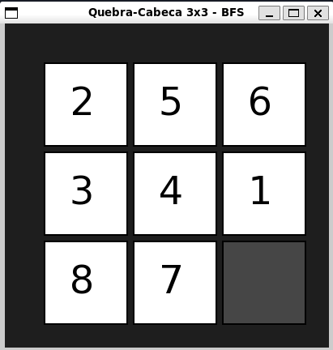

# Passo a passo para executar o código


### 1. Entre no diretório do projeto
```bash
cd bfs-puzzle-3x3
```

### 2. Instale as bibliotecas gráficas necessárias (No Linux)
```bash
sudo apt update
sudo apt install libsfml-dev
```

### 3. Compile com o seguinte comando
```bash
g++ main.cpp -o puzzle -lsfml-graphics -lsfml-window -lsfml-system
```

### 4. Execute com o seguinte comando
```bash
./puzzle
```

### Imagem do jogo

